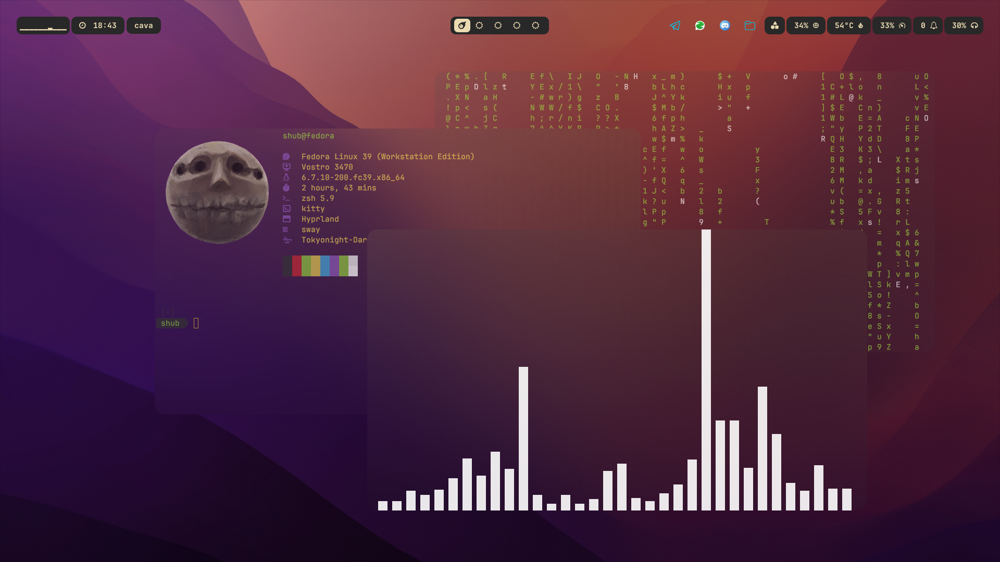
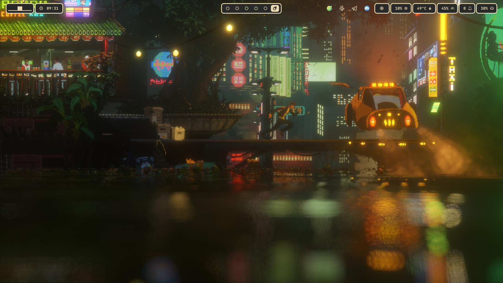
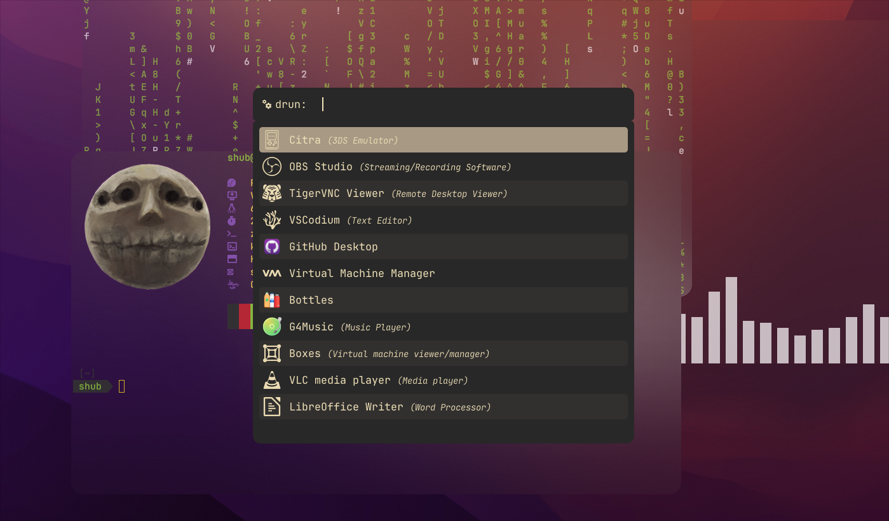
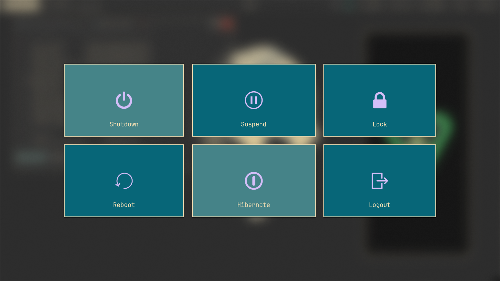

# **`shub39's` Hyprland Dotfiles**

My config files for hyprland and other utilities with some shell scripts that I have been daily driving for about 2 years now. **Heavily customised for my workflow and only meant to be a reference**

> 
> 
> 
> 
> 
> []()

## Screenshots





> [!WARNING]
> This is only meant to be a quick reproducible setup for me. Please don't assume this setup to be a complete package suiting all your needs. You should explore this config on your own, understand stuff and customize this further according to your needs instead of blindly trusting me to magically know everything you want. If you are new to linux and don't identify as a masochist, I strongly suggest you to try a beginner friendly linux distro like Linux Mint or Ubuntu for a few months to get familiar before making the switch.

## Packages

### Official Repo
Needed
```
ttf-jetbrains-mono ttf-jetbrains-mono-nerd hyprpicker hyprpaper neovim polkit-gnome nwg-look noto-fonts noto-fonts-emoji noto-fonts-extra noto-fonts-cjk swaync waybar hyprlock gnome-terminal chromium cava scrcpy nemo rofi-wayland cmus copyq flatpak fastfetch imagemagick
```

My preferred extras
```
mpv loupe gnome-boxes gnome-disk-utility gnome-system-monitor nemo-fileroller
```

### AUR
```
gruvbox-dark-icons-gtk gruvbox-material-gtk-theme-git hyprshot wlogout zen-browser-bin hyprsunset
```

### Flatpak
```
it.mijorus.smile
```

## Installation

- Clone this repo at `.config/` in your home directory

```bash
git clone https://github.com/shub39/dotfiles
```

- Edit `~/.config/hypr/hyprland.conf` to only include `source = ~/.config/dotfiles/hyprland/hyprland.conf`
```bash
echo 'source = ~/.config/dotfiles/hyprland/hyprland.conf' > ~/.config/hypr/hyprland.conf
```

- Reboot

## Extras

- [Lumi](https://github.com/shub39/lumi) waybar module to display synced lyrics of your current playing song
- [NvChad](https://nvchad.com/) a preconfigured neovim setup
- [Zsh config](https://github.com/pixegami/terminal-profile) for this setup, **edit the scripts according to your package manager first**

## Star History

[](https://starchart.cc/shub39/dotfiles)
