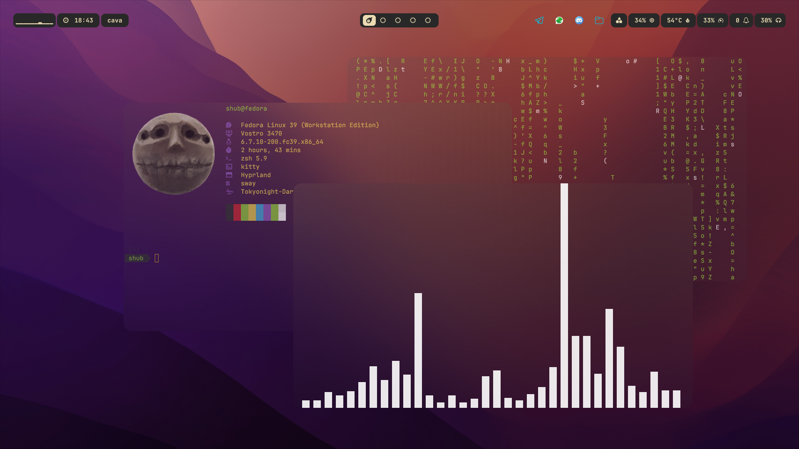
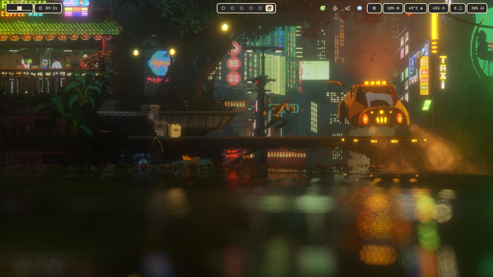
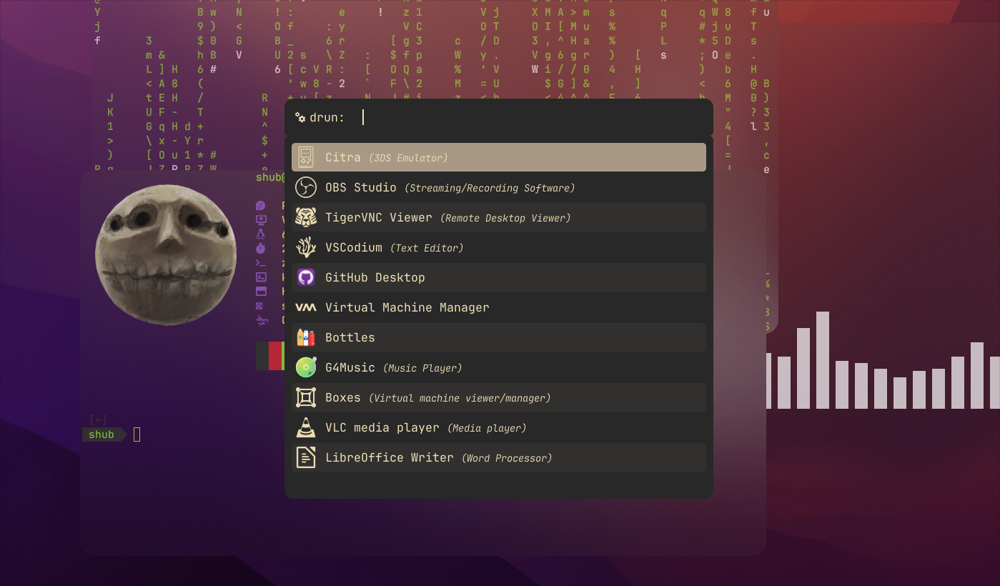

# DotFiles
Dot files for my hyprland configuration. Using gruvbox color palette. I think i have finished it. Currently using on Fedora 39

## Packages
1) hyprland
2) kitty
3) neofetch
4) rofi 
5) swaylock
6) swaync
7) waybar
8) wlogout

## Plans
1) Do something about wifi.
2) Add a install script.
3) Add scripts to explain keybinds and make it simpler to use.
4) Continue Using it.

